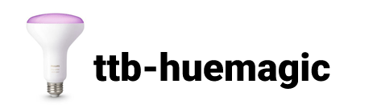

# Philips Hue devices for TimeSquAir and the Thingbox

These NodeRED nodes allow you to **use Philips Hue devices without technical knowledge**, by removing most of mandatory code.

**The Thingbox** (http://theThingbox.io) is a ready to flash RaspberryPi image that contains Node-RED ready to use.
The Thingbox is the easiest and quickiest way to get Node-RED running on a Pi. All Free.

These nodes also work on stock NodeRED.

Features
-------

HueMagic provides several input and output nodes for Node-RED and is the most in-depth and easy to use solution to control Philips Hue bridges, lights, groups, scenes, taps, switches, motion sensors, temperature sensors and Lux sensors.

* Simple and comprehensive control of the Hue Bridge and connected devices
* Automatic discovery of Philips Hue bridges as well as devices, scenes & groups…
* Supports the output and input of multiple color code definitions *(HEX, RGB & human readable color names)*
* Event-based status messages for all devices connected to the Hue Bridge
* Real-time status messages in the NodeRED UI
* Supports virtual pressing of the button on the Hue Bridge (Link Button)
* Programmatic pairing of new devices without app enforcement (TouchLink)
* Automatic firmware updates to the Hue Bridge and connected devices
* Supports activating / deactivating of motion sensors
* Easy to use alarm and colorloop effects on light bulbs and whole groups
* Additive state settings on all nodes with multiple commands

Documentation
-------------

- full pdf [Hue book](http://thethingbox.io/docs/Hue-Book.pdf)

Credits
-------

All this built on top of the outstanding work of [HueMagic](https://github.com/Foddy/node-red-contrib-huemagic/blob/master/README.md) from Foddy Botosakis.

> if you are a programmer, you can rather use the original version.

Please  if you use it. (many people give as much as 1 dollar)

